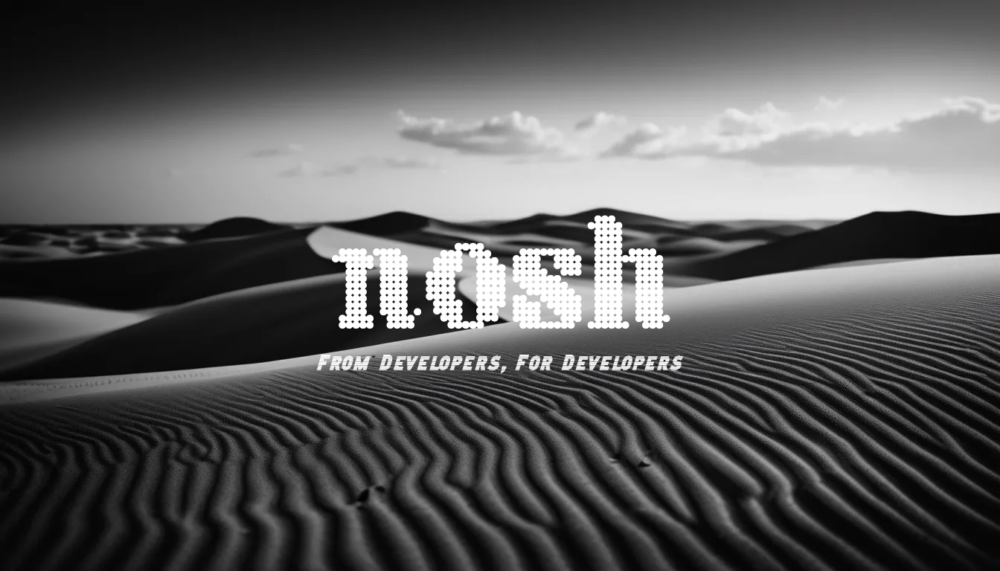

<div align="center">
  
</div>

# nosh - Network Oriented Security Shell

`nosh` is a modern, security-focused shell designed with both usability and security in mind. It provides enhanced command-line functionality, network security features, and secure credential management.

## Build Status

[](https://github.com/Dynamicaaa/nosh/actions/workflows/c-cpp.yml)

Builds are available for and automatically tested on:

-   Linux (x86_64)
-   macOS (x86_64 built on macOS 13)
-   macOS (arm64 built on the latest macOS)
-   Windows (x86_64)

Artifacts (executables) are uploaded for each successful build. You can find them in the "Actions" tab of the GitHub repository.

## Key Features

### Basic Shell Features

-   Command history with persistent storage
-   Command aliases with persistent configuration
-   Environment variable management
-   Wildcard expansion for filenames
-   Background process execution
-   Command substitution

### Security Features

-   XNU Hardened Mode for sensitive operations
-   Secure file wiping with zero-fill overwriting
-   Encrypted password manager (Citrus)
-   Network security monitoring and analysis
-   Command sanitization to prevent injection attacks

### Environment Management

-   Support for `.noshrc` configuration files
-   Environment variable persistence
-   Path management

## Getting Started

### Dependencies

-   GCC or compatible C compiler (Clang, MSVC with MinGW on Windows).
-   GNU Readline library (required for command line editing and history).
-   mbed TLS (for the password manager encryption).
-   Argon2 (for key derivation).
-   pkg-config (for finding libraries, particularly on macOS).
-   CMake (for building the project).

On Debian/Ubuntu:

```bash
sudo apt-get update
sudo apt-get install -y build-essential libreadline-dev libmbedtls-dev libargon2-dev pkg-config cmake
```

On macOS (using Homebrew):

```bash
brew install readline openssl mbedtls argon2 pkg-config cmake
```

On Windows (using MSYS2):

1.  Install MSYS2 from [https://www.msys2.org/](https://www.msys2.org/).
2.  Open the MSYS2 MinGW 64-bit shell.
3.  Run the following commands:

    ```bash
    pacman -Syu  # Update package database and base packages
    pacman -Su   # Update system packages
    pacman -S --needed mingw-w64-x86_64-gcc mingw-w64-x86_64-cmake mingw-w64-x86_64-make mingw-w64-x86_64-mbedtls mingw-w64-x86_64-argon2 mingw-w64-x86_64-pkgconf mingw-w64-x86_64-readline mingw-w64-x86_64-windows-default-manifest mingw-w64-x86_64-ncurses mingw-w64-x86_64-pdcurses git
    ```

### Installation

1.  **Clone the repository:**

    ```bash
    git clone https://github.com/Dynamicaaa/nosh.git
    ```

2.  **Build from source:**

    ```bash
    cd nosh
    mkdir build
    cd build
    ```

    **On Linux, macOS, and Windows (MSYS2 MinGW):**

    ```bash
    cmake .. -DCMAKE_BUILD_TYPE=Release
    make
    ```

    **On macOS, you might need to provide additional hints to CMake:**

    ```bash
    cmake .. -DCMAKE_BUILD_TYPE=Release \
        -DCMAKE_PREFIX_PATH="$(brew --prefix)" \
        -DMBEDTLS_ROOT_DIR=$(brew --prefix mbedtls) \
        -DARGON2_ROOT_DIR=$(brew --prefix argon2) \
        -DCMAKE_FIND_FRAMEWORK=LAST \
        -DCMAKE_INSTALL_NAME_DIR=@executable_path/../lib \
        -DCMAKE_BUILD_WITH_INSTALL_NAME_DIR=ON \
        -DCMAKE_LIBRARY_PATH="/usr/local/lib" \
        -DCMAKE_INCLUDE_PATH="/usr/local/include" \
        -DCMAKE_EXE_LINKER_FLAGS="-L/usr/local/lib"
    ```
     If building for a specific architecture on macOS (e.g., arm64), also add: `-DCMAKE_OSX_ARCHITECTURES=arm64`  (replace `arm64` with `x86_64` if needed).

    **On Windows (MSYS2 MinGW), a specific configuration is *required*:**

    ```bash
    cmake .. -G "MinGW Makefiles" \
      -DCMAKE_BUILD_TYPE=Release \
      -DCMAKE_C_COMPILER=/mingw64/bin/gcc.exe \
      -DCMAKE_MAKE_PROGRAM=/mingw64/bin/mingw32-make.exe \
      -DCMAKE_C_FLAGS="-D_GNU_SOURCE -D_WIN32 -DWIN32_LEAN_AND_MEAN" \
      -DCMAKE_PREFIX_PATH=/mingw64 \
      -DCMAKE_LIBRARY_PATH=/mingw64/lib \
      -DCMAKE_INCLUDE_PATH="/mingw64/include;/mingw64/include/readline" \
      -DREADLINE_ROOT=/mingw64 \
      -DCMAKE_EXE_LINKER_FLAGS="-static-libgcc -static-libstdc++ -Wl,-Bstatic -lpdcurses -lreadline -lmbedtls -lmbedcrypto -lmbedx509 -largon2 -Wl,-Bdynamic -lws2_32 -liphlpapi -lbcrypt"
    ```

    Then build:

    ```bash
    make
    ```
3.  **Install (optional):**  This step is optional but places the `nosh` executable in a standard system location.

    On Linux/macOS:

    ```bash
    sudo make install  # Installs to /usr/local/bin by default
    ```

    On Windows, manual copying of the `nosh.exe` to a directory in your `PATH` is recommended.  There isn't a standard "install" process with `mingw32-make`.

### Basic Usage

```bash
# Start nosh
./nosh

# Start nosh in XNU (hardened) mode
./nosh --xnu
```

## Command Reference

### Shell Navigation

-   `cd [dir]` - Change directory
-   `pwd` - Print working directory
-   `clear` - Clear terminal screen

### File Operations

-   `ls`, `cp`, `mv`, etc. - Standard file operations
-   `wipe <file>` - Securely erase and delete sensitive files

### History Management

-   `history` - View command history
-   `clear-history` - Clear command history

### Alias Management

-   `alias [name] [cmd]` - Create or list aliases
-   `unalias [name]` - Remove an alias

### Environment Variables

-   `export VAR=VALUE` - Set environment variable
-   `export VAR` - Display variable value
-   `env` - List all environment variables
    -   `echo [args...]` - Displays arguments, and it now supports wildcard and environment variable expansion

### Security Features

-   `xnu` - Toggle XNU hardened security mode
-   `citrus init` - Initialize password manager
-   `citrus add <service> <username>` - Add a password
-   `citrus get <service> <username>` - Retrieve a password
-   `citrus list` - List stored passwords
-   `integrity verify <file>` - Verify file integrity
-   `integrity gen <file>` - Generate integrity hash for file

### Network Security

-   `network ports` - List open ports
-   `network connections` - Show active connections
-   `network suspicious` - Check for suspicious activity
-   `network interfaces` - Show network interface details
-   `network firewall` - Check firewall status
-   `network scan` - Run a basic security scan

## Wildcard Support

The shell supports standard glob patterns:

-   `*` - Matches any sequence of characters
-   `?` - Matches any single character
-   `[...]` - Matches any character in brackets
-   `~` - Expands to HOME directory

Examples:

```bash
ls *.txt
cat ~/README*
echo /etc/*.conf
```

## XNU Hardened Mode

XNU mode provides enhanced security for sensitive operations:

- Disables command history
- Disables aliases 
- Sanitizes commands to prevent injection
- Blocks path traversal attempts
- Enforces file permission checks
- Only allows execution of root/user-owned files
- Never logs commands
- Clears terminal on exit

Enable with:
```bash
# Enable XNU mode persistently
nconfig xnu true

# Disable XNU mode
nconfig xnu false

# Start shell in XNU mode
./nosh --xnu
```

## Password Manager

The integrated Citrus password manager securely stores credentials using AES-256-GCM encryption with Argon2id key derivation:

```bash
# Initialize (first time only)
citrus init

# Add a password
citrus add github myusername

# Retrieve a password
citrus get github myusername

# List all stored services
citrus list
```

## Configuration

You can customize nosh by creating a `.noshrc` file in your home directory:

```bash
# Example .noshrc
export PATH=$PATH:/usr/local/bin
export EDITOR=vim
alias ll="ls -la"
alias gs="git status"
```

## Security Best Practices

1.  Use XNU mode when handling sensitive information.
2.  Use the `wipe` command instead of `rm` for sensitive files.
3.  Regularly check your network security with `network scan`.
4.  Store important credentials in the password manager.
5.  Run `clear-history` after sensitive operations.

## License

This software is licensed under the MIT License. See the LICENSE file for details.

## Contributing

Contributions are welcome! Please feel free to submit a Pull Request.  Before submitting, please make sure your code builds cleanly on all supported platforms (Linux, macOS, and Windows) and passes the automated tests.
